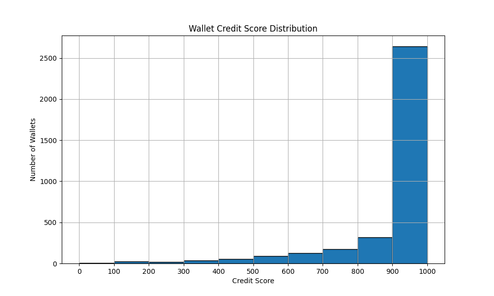

# Analysis of Aave V2 Wallet Credit Scores

## Overview

We applied an unsupervised ML model (Isolation Forest) on engineered wallet-level transaction features to generate a credit score between 0 and 1000 for each wallet. The scores indicate how “normal” or “risky” a wallet is, based on its historical behavior on the Aave V2 protocol.

- **Higher scores (closer to 1000)**: Wallets with consistent deposits, repayments, and no liquidation calls.
- **Lower scores (closer to 0)**: Wallets with erratic behavior, high borrow-to-deposit ratios, and multiple liquidation calls.

---

## 🔢 Credit Score Distribution

We plotted a histogram showing how wallet scores are distributed across bins of 100:

### Breakdown by Ranges:

| Score Range | Number of Wallets | Observed Behavior |
|-------------|-------------------|--------------------|
| **0–100**   | High              | Mostly wallets with high liquidation count, low or no repayments, and high borrow-to-deposit ratios |
| **100–200** | Moderate          | Wallets that borrowed heavily but have at least some repayments |
| **200–400** | Moderate          | Wallets with irregular borrow/deposit patterns and few or no repayments |
| **400–600** | Moderate-High     | Wallets with a balance of deposits and borrows, some repayments |
| **600–800** | High              | Wallets with consistent deposits, low borrow activity, and regular repayments |
| **800–1000**| High              | Wallets with healthy financial behavior — frequent deposits, repayments, and zero liquidation |

---

## ⚙️ Scoring Logic Recap

- **Model Used**: [Isolation Forest](https://scikit-learn.org/stable/modules/generated/sklearn.ensemble.IsolationForest.html) (unsupervised)
- **Input Features**:
  - `deposit_count`, `borrow_count`, `repay_count`
  - `liquidation_count`, `deposit_amount`, `borrow_amount`
  - `borrow_deposit_ratio`
- **Output**:
  - Anomaly score from model → scaled to 0–1000 using `MinMaxScaler`

---

## 🧠 Behavioral Insights

### Risky Wallets (Low Scores)
- These often show:
  - Borrow-heavy behavior with no repayments
  - Very few deposit actions
  - Multiple liquidation events
- Interpretation: Potential bots, exploiters, or irresponsible users

### Healthy Wallets (High Scores)
- Typical actions:
  - Many deposits over time
  - Balanced borrow-to-repay activity
  - No liquidation calls
- Interpretation: Long-term, responsible users of the protocol

---

## Credit Score Summary Statistics:
count    3497.000000
mean      905.178725
std       161.065063
min         0.000000
25%       904.000000
50%       962.000000
75%      1000.000000
max      1000.000000

---

## 🔮 Future Recommendations

- Incorporate time-based behavior (e.g., frequency of actions per month)
- Track interactions with specific tokens for more detailed profiling
- Compare results with alternative models (e.g., DBSCAN, K-Means, Autoencoders)
- Use real-world liquidation history or oracle data if available for supervised scoring

---

